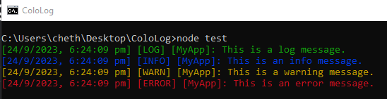

<p align="center"><a href="https://nodei.co/npm/cololog/"></a></p>
<p align="center">     <a href="https://discord.gg/R33e7Pm5YV"></a></p>

# ColoLog

ColoLog Logger is a lightweight and easy-to-use JavaScript logging utility that enhances your console logging experience. It allows you to add colorful log messages with various log levels (log, info, warn, error) to your Node.js or browser applications. With a clean and customizable layout, it's perfect for enhancing your project's debugging and monitoring capabilities.

**Features:**
- Lightweight and minimal setup
- Colorful log messages for improved readability
- Support for different log levels
- Customizable log prefix for easy identification
- Simplifies and enhances console logging

---

## Installation

Install ColoLog using npm:

```bash
npm install cololog
```

```bash
yarn add cololog
```

## Usage

To use ColoLog in your project, import the module and create a new instance of the logger. You can then use the logger to log messages to the console.

```javascript
const CustomLogger = require('cololog');


// Create a new instance of the logger
const logger = new CustomLogger('MyApp');


// Log messages to the console
logger.log('This is a log message.');
logger.info('This is an info message.');
logger.warn('This is a warning message.');
logger.error('This is an error message.');
```

---
**Output:**
<p align="center"></p>